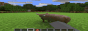

# Native MLCE

  
          

---
This project is a heavily modified fork based on the [portable-lce](https://github.com/portable-lce/portable-lce), targeting the Native Android port.
> [!WARNING]
> This project is in deep WIP development.
> Compatibility of assemblies is not guaranteed.
## Status

| Component       | Stack       | Porting Status |
| --------------- | ----------- | -------------- |
| **app**         | `android`   | Passing        |
| **ui**          | `java`      | In Progress    |
| **fs**          | `std`       |                |
| **renderer**    | `gl`        | In Progress    |
| **sound**       | `miniaudio` |                |
| **input**       | `sdl2`      |                |
| **thread**      | `std`       |                |
| **game**        | `stub`      |                |
| **network**     | `stub`      |                |
| **storage**     | `stub`      |                |
| **profile**     | `stub`      |                |
| **leaderboard** | `stub`      |                |
